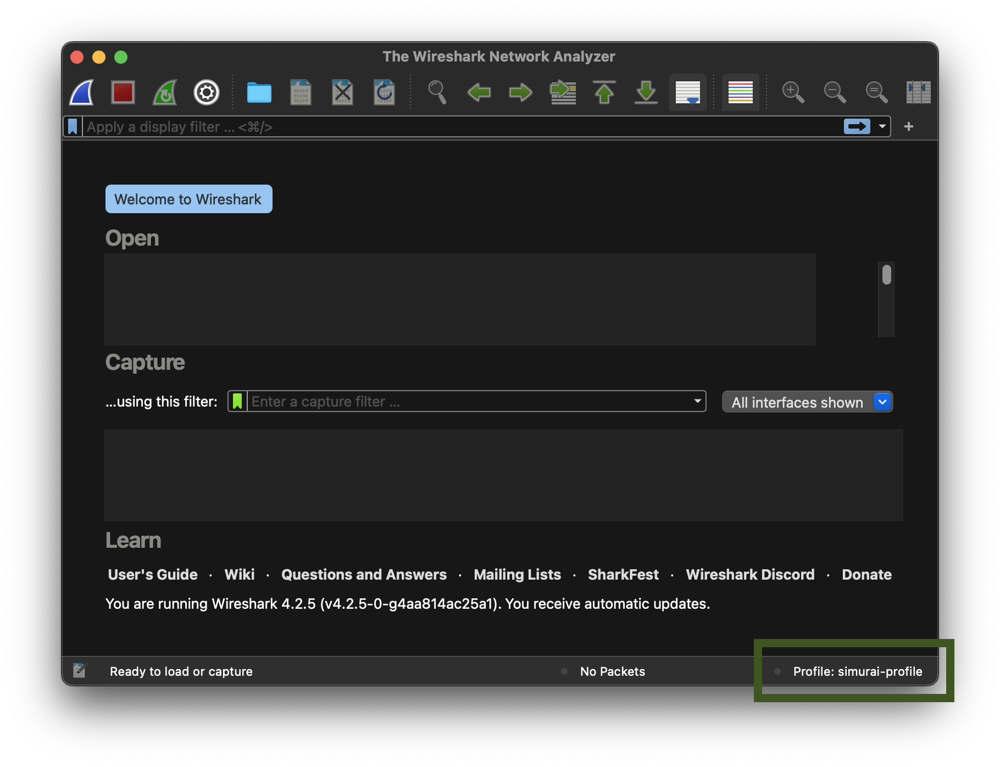

In its default configuration, Wireshark will not correctly display all packets and relevant data of our PCAPs. Hence, we provide a Wireshark profile with the required configuration, and the same look-and-feel as the screenshots. Multiple profiles can co-exist, and you can de-select the profile again.

### Prerequisites

First, install Wireshark from the repositories or visit [wireshark.org](https://www.wireshark.org) for instructions:

```
$ sudo apt install wireshark
```

Then, identify the configuration directory:

Open Wireshark and select `About Wireshark -> Folders -> Personal Configuration`. On Linux and macOS, it is typically located here: `~/.config/wireshark/profiles`

### Profile Installation

Copy `./simurai-profile` to the profile folder, e.g., `~/.config/wireshark/profiles/`, depending on your platform. It should look like the following:

```
.config/wireshark/profiles/simurai-profile
├── decode_as_entries
├── disabled_protos
├── enabled_protos
├── heuristic_protos
├── preferences
├── recent
└── user_dlts

1 directory, 7 files
```

Then, you can select the profile on the bottom right of the Wireshark window.



### Removal

De-select the profile, and/or remove the `simurai-profile` folder from the profile directory.